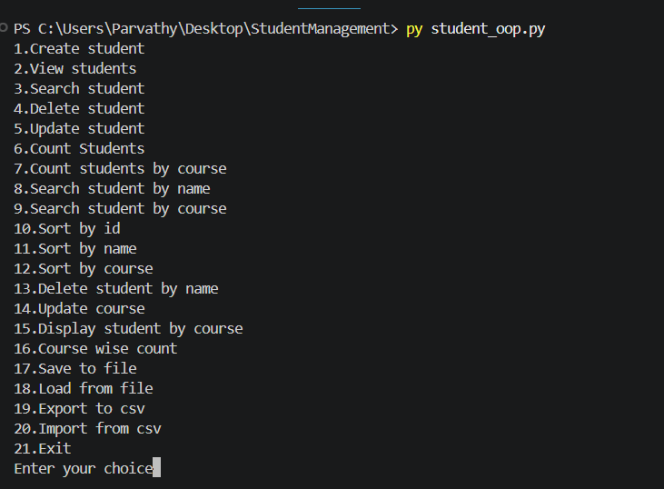
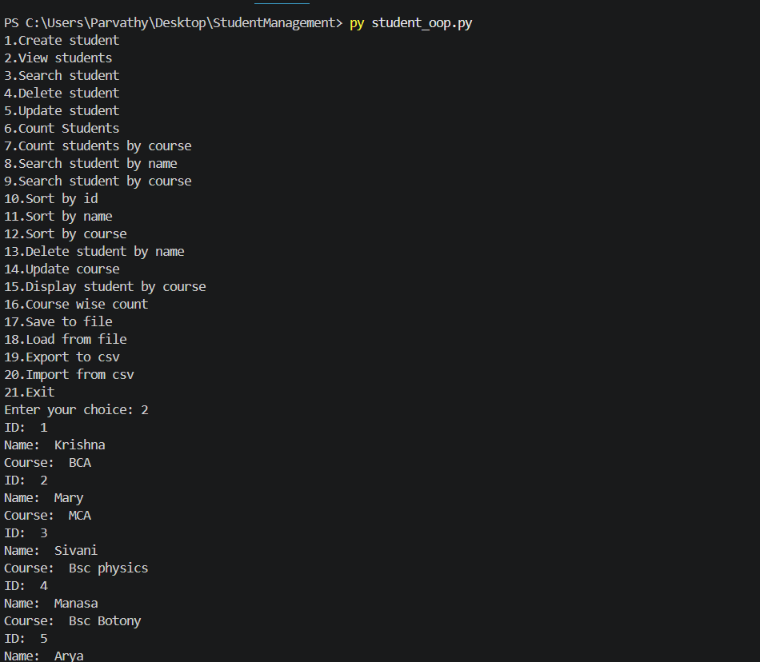
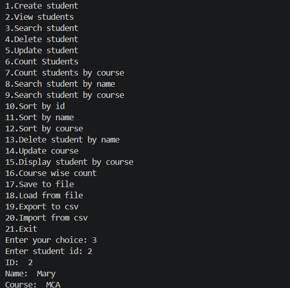
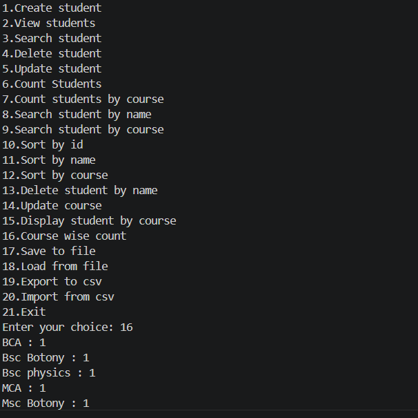
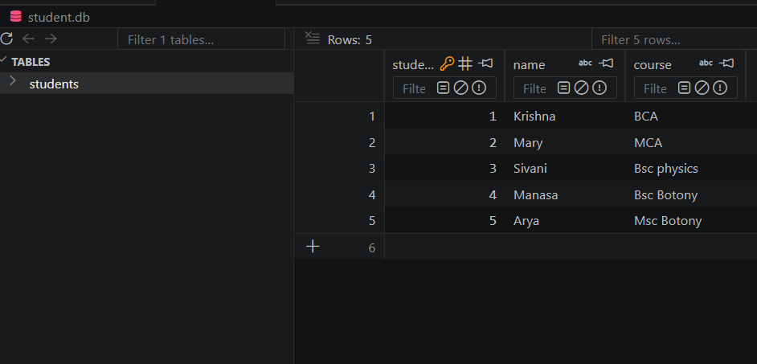

# Student Management System (Python + SQLite)

## Overview

A menu-driven Student Management System developed using Python and SQLite. It supports CRUD operations, searching, sorting, file handling, and CSV import/export.

## Features

- Create Student
- View Students
- Search by ID
- Search by Name
- Search by Course
- Update Student
- Delete Student
- Delete by Name
- Update Course
- Count Students
- Course-wise Count
- Sort by ID
- Sort by Name
- Sort by Course
- Save to TXT
- Load from TXT
- Export to CSV
- Import from CSV

## Technologies Used

- Python
- SQLite3
- CSV Module
- File Handling

## How to Run

```bash
python student_oop.py
```
## Main Menu



## View Students



## Search Student



## Course-wise Count



## SQLite Database



## Author

**Parvathy A**
